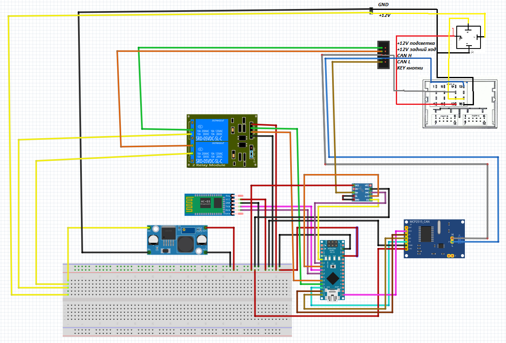

# PSA-CAN-adapter
Прослойка между CAN шиной автомобиля и китайским ГУ(или любым другим)

Подключение к CAN шине идет с помощью mcp2515 8mhz, скорость 125 kbps посредством SPI, управляющий пин - 10.
Общение по серийному порту на скорости 9600 бод, используется для настройки и логирования.
Передача режимов включения заднего хода и подстветки - 2 канальный модуль реле.
Передача сопротивлений для кнопок - X9C104.

С шины автомобиля берутся 3(4) пакета:
 
0x21F - обработка основного блока кнопок
 
0xA2  - обработка дополнительного блока кнопок (убрано. так как мне это не надо)
 
0xF6  - получение информации о включенной передаче заднего хода
 
0x128 - получение информацию о включенных ПТФ
 
Также с помощью последовательной шины можно управлять БК.
 
Добавлена возможность логированияи вывода информации БК в приложение на андроиде

 
